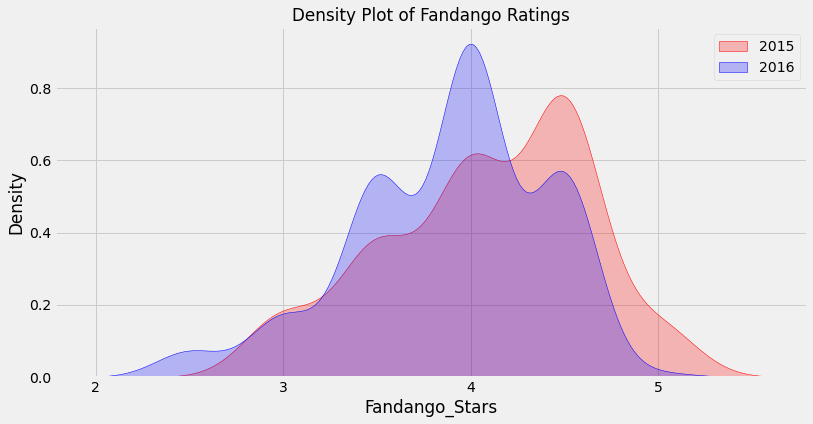

# Does Fandango Still Inflate Their Movie Ratings
In October 2015, a data journalist named Walt Hickey analyzed movie ratings data and found strong evidence to suggest that Fandango's rating system was biased and dishonest. He published his analysis in [this article](https://fivethirtyeight.com/features/fandango-movies-ratings/).
Hickey found that there's a significant discrepancy between the number of stars displayed for movie ratings and the actual rating, 

**The goal** of this project is to analyze more recent movie ratings data to determine whether there has been any change in Fandango's rating system after Hickey's analysis in 2015.

- Walt Hickey made the data he analyzed publicly available on [GitHub](https://github.com/fivethirtyeight/data).
- The dataset we are working with comes from [here](https://www.freecodecamp.org/news/whose-reviews-should-you-trust-imdb-rotten-tomatoes-metacritic-or-fandango-7d1010c6cf19/). 
- The github for the data is [here](https://github.com/mircealex/Movie_ratings_2016_17)

**RESULTS**

While the median is the same for both distributions, the mode is lower in 2016 by 0.5. Coupled with what we saw for the mean, the direction of the change we saw on the kernel density plot is confirmed: on average, popular movies released in 2016 were rated slightly lower than popular movies released in 2015.

We cannot be completely sure what caused the change, but the **chances are very high that it was caused by Fandango fixing the biased rating system after Hickey's analysis**.